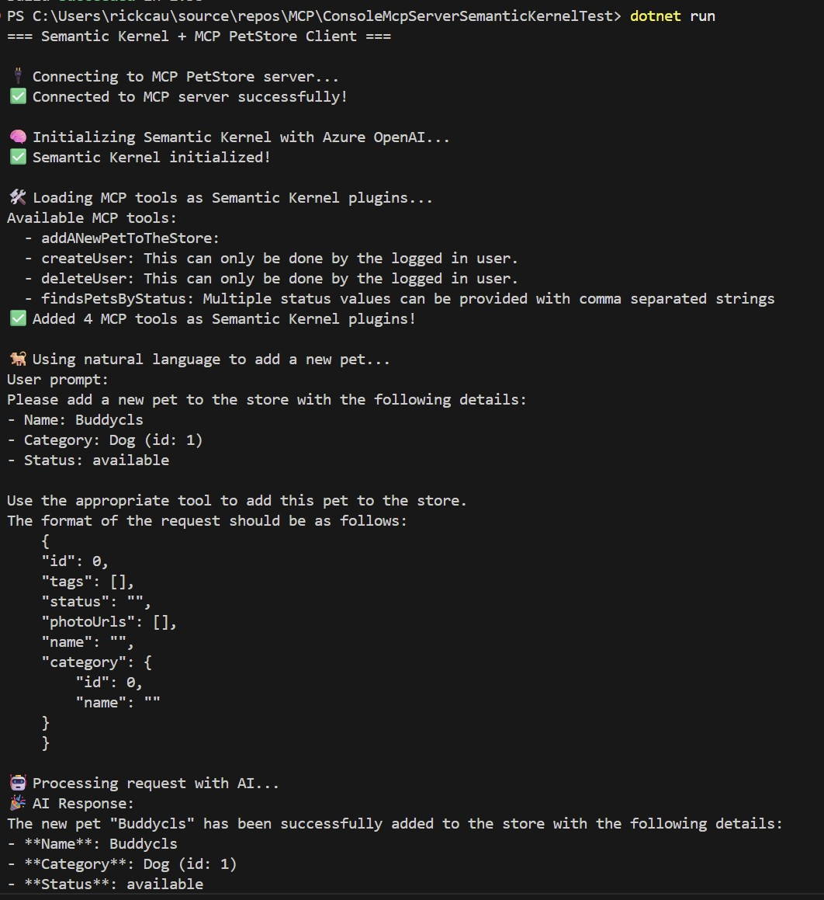

# ConsoleMcpServerSemanticKernel
This example is based on the **ConsoleMcpSeverTest** but it leverages Azure OpenAI and Semantic Kernel and Natural Language in a GenAI way to demostrate how to make sure of 
MCP Server Tools with Semantic Kernel.

## Running the example
1. Navigate to the `ConsoleMcpServerSemanticKernelTest` folder and run the following command:

   ```
      dotnet run
   ```

   You will see the following output if you have all your configuration variables properly set.

   