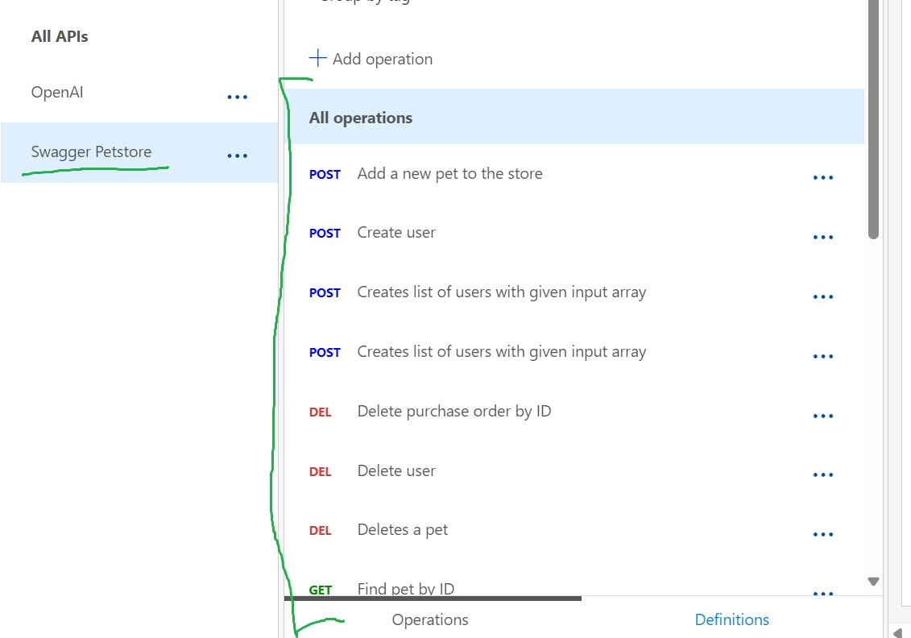
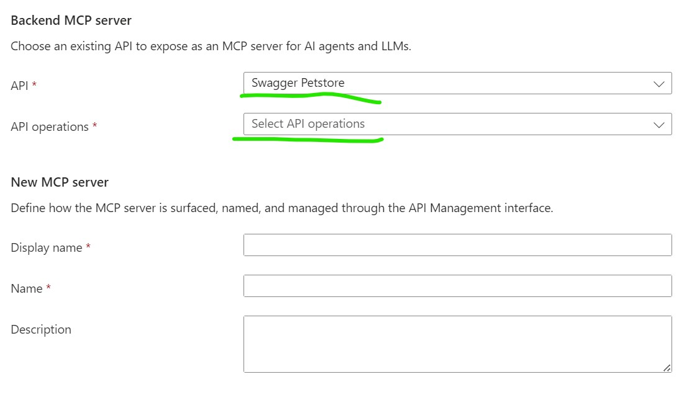

# ConsoleMcpServerTest
This example makes use of the well known [Petstore REST API](https://petstore.swagger.io/) and the new MCP Server Preview feature in Azure APIM.

## Setup API Management in Azure
Create an APIM instance in Azure. You have to use Basic V2 or higher in order to get support for the new [MCP Server (Preview)](https://techcommunity.microsoft.com/blog/integrationsonazureblog/%F0%9F%9A%80-new-in-azure-api-management-mcp-in-v2-skus--external-mcp-compliant-server-sup/4440294) feature in APIM.

1. Navigate to the APIs tab and click on **Add API**, then under **Create form definition** click on `OpenAPI` and populate the dialog with the values in the image below, then click on **Create**. This will result in an endpoint with the following operations:



After completing these steps you will have a Petstore REST API exposed through APIM in Azure and you can call it using the URL and operations you exposed in APIM!

## Expose the operations as tools via an MCP Server
Now, that we have our API exposed in APIM, we can create an MCP Server and select which operations we want to expose as tools.

1. Now, under the APIs tab you will see **MCP Servers (preview)**, click on it, then click on **Create MCP Server** and select **Expose an API as an MCP Server**.  You will be presented with the following screen:



Now, select **Swagger Petstore** and select the following operations:

- /pet (Add a new pet to the store)
- /user (Create user)
- /user/{username} (Delete user)
- /pet/findByStatus?status={status} (Finds Pets by status)

Provide whatever you prefer for Display Name, Name and Description, then click on **Create**

Now, you have successful create a remote MCP Server with this operations exposed as Tools using the Model Context Protocol which can be used with an MCP Client and the tools can be leverage with LLMs and function calling.

In the example example I will demostrate how this this remote MCP Server and the tools can be leveraged using an LLM with Semantic Kernel Auto Function calling.  This is a great way to expose common tools that can be reused across various AI use cases.  The great thing about this approach is you can leveage all the great features of APIM with this MCP Server.

## Test our MCP Server using MCP Inspector
This is super simple to test.

1. Open a Terminal Window In VS Code and run the following command:

   ```
      npx @modelcontextprotocol/inspector

   ```

   This will launch the **MCP Inspector** and a Browser window will appear with a UI.  Make sure you have **Streamable HTTP** selected and the URL points to your `MCP Server` you exposed in APIM.  Here is an example of my setting this up and clicking on Connect.

   

   You can see that I was able to connect and initialize.

2. Now, I am going to click on **List Tools** so you can see how it was able to enumerate the tools (operations) I exposed via APIM.


## Test our MCP Server using DotNet and the ModelContextProtocol Nuget (Preview) Package
1. Simply open the **ConsoleMcpServerTest** folder in the **Terminal** and run the following command:

   ```
     dotnet run
   ```

   You will see the following output in the terminal window, which demonstrates our MCP Server is working and we are able to list the available tools.

   